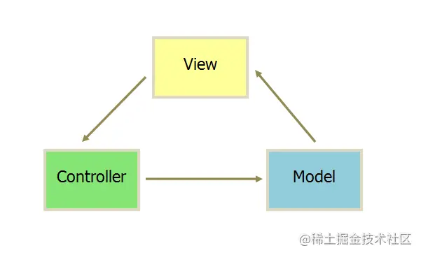
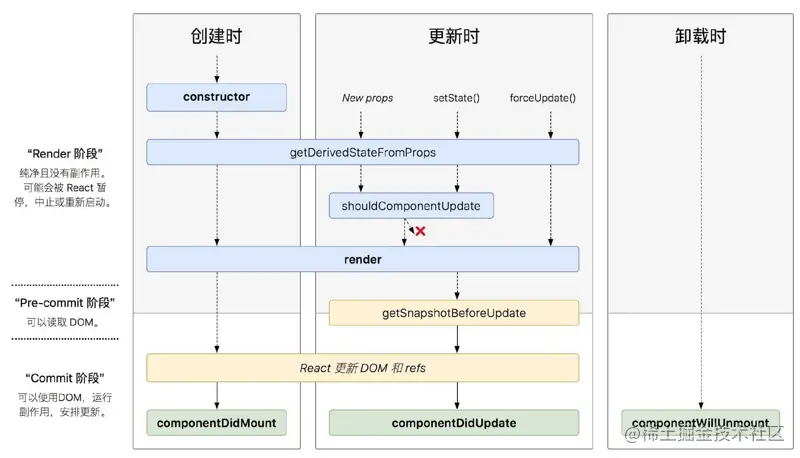

作为一个长年Vuer，但却有一颗reacter的心。之前听过一个比喻，不知道恰不恰当。”vue是自动挡，react是手排挡“。今天也来开个手排挡，老铁上车。😎

## React基础

### mvc架构

* 视图（View）：用户界面。
* 控制器（Controller）：业务逻辑
* 模型（Model）：数据保存



### 函数式编程

#### **定义**：

简单说，"函数式编程"是一种[&#34;编程范式&#34;](https://en.wikipedia.org/wiki/Programming_paradigm)（programming paradigm），也就是如何编写程序的方法论。

它属于[&#34;结构化编程&#34;](https://en.wikipedia.org/wiki/Structured_programming)的一种，主要思想是把运算过程尽量写成一系列嵌套的函数调用。举例来说，现在有这样一个数学表达式：

> 　　(1 + 2) * 3 - 4

 传统的过程式编程，可能这样写：

> 　　var a = 1 + 2;
>
> 　　var b = a * 3;
>
> 　　var c = b - 4;

函数式编程要求使用函数，我们可以把运算过程[定义](http://lostechies.com/derickbailey/2012/01/24/some-thoughts-on-functional-javascript/)为不同的函数，然后写成下面这样：

> 　　var result = subtract(multiply(add(1,2), 3), 4);

这就是函数式编程。

#### **特点：**

##### **1. 函数是"第一等公民"**

所谓[&#34;第一等公民&#34;](https://en.wikipedia.org/wiki/First-class_function)（first class），指的是函数与其他数据类型一样，处于平等地位，可以赋值给其他变量，也可以作为参数，传入另一个函数，或者作为别的函数的返回值。

##### **2. 只用"表达式"不用"语句"**

"表达式"（expression）是一个单纯的运算过程，总是有返回值；"语句"（statement）是执行某种操作，没有返回值。函数式编程要求，只使用表达式，不使用语句。也就是说，每一步都是单纯的运算，而且都有返回值。

原因是函数式编程的开发动机，一开始就是为了处理运算（computation），不考虑系统的读写（I/O）。"语句"属于对系统的读写操作，所以就被排斥在外。

当然，实际应用中，不做I/O是不可能的。因此，编程过程中，函数式编程只要求把I/O限制到最小，不要有不必要的读写行为，保持计算过程的单纯性。

##### **3. 没有"副作用"**

所谓[&#34;副作用&#34;](https://en.wikipedia.org/wiki/Side_effect_(computer_science))（side effect），指的是函数内部与外部互动（最典型的情况，就是修改全局变量的值），产生运算以外的其他结果。

函数式编程强调没有"副作用"，意味着函数要保持独立，所有功能就是返回一个新的值，没有其他行为，尤其是不得修改外部变量的值。

##### **4. 不修改状态**

上一点已经提到，函数式编程只是返回新的值，不修改系统变量。因此，不修改变量，也是它的一个重要特点。

在其他类型的语言中，变量往往用来保存"状态"（state）。不修改变量，意味着状态不能保存在变量中。函数式编程使用参数保存状态，最好的例子就是递归。下面的代码是一个将字符串逆序排列的函数，它演示了不同的参数如何决定了运算所处的"状态"。

##### **5. 引用透明**

**引用透明（Referential transparency），指的是函数的运行不依赖于外部变量或"状态"，只依赖于输入的参数，任何时候只要参数相同，引用函数所得	到的返回值总是相同的。有了前面的第三点和第四点，这点是很显然的。其他类型的语言，函数的返回值往往与系统状态有关，不同的状态之下，返回值是不一样的。这就叫"引用不透明"，很不利于观察和理解程序的行为。**

### JSX语法

`把html代码直接写在js里 遇到  < >   的内容用html解析，遇到   {  }   的内容用js解析`

如何解析jsx语法的研究下回分解

### 单向数据流

只要将一些服务端的数据和前端页面绑定好，开发者只关注实现业务就行了

### 虚拟DOM与Diff算法

该知识点另开篇做深入研究

### state和props

#### state：

React 的核心思想是组件化，而组件中最重要的概念是State（状态），State是一个组件的UI数据模型，是组件渲染时的数据依据。

状态（state） 和 属性（props） 类似，都是一个组件所需要的一些数据集合，但是state是私有的，可以认为state是组件的“私有属性（或者是局部属性）”。

###### 4步走判断是否为State

1. 变量来自Props吗？
2. 变量在生命周期保持不变吗？
3. 变量可以通过其他State或Props计算得到吗？
4. 变量没有在render方法中使用？

   如果以上4个灵魂答案都 **[是] **;那么他不是一个状态了

###### 这玩意怎么用呢？

setState更新状态（地球人都知道）

在组件中调用的方法。只有两个方法：`setState()` 和 `forceUpdate()`

```
更新状态setState()
```

```
setState(updater, [callback])
```

***参数一 :  updater***

* [X] *可以是return一个对象里面是state的响应式数据 --> {xxx : xxx}*
* [X] *也可以是个func 该方法有两个参数（prevState，props）上一个state的结果与props*

```
this.setState((state, props) => {
  return {counter: state.counter + props.step};
});
```

`setState()` 并不总是立即更新组件。它会批量推迟更新。这使得在调用 `setState()` 后立即读取 `this.state` 成为了隐患。为了消除隐患，请使用 `componentDidUpdate` 或者 `setState` 的回调函数（`setState(updater, callback)`），这两种方式都可以保证在应用更新后触发。

经典的state++ 问题：

```
// 正确
this.setState((prevState, props) => ({
  counter: prevState.counter + props.increment
}));
//注意：下面这样是错的
this.setState((prevState, props) => { //没将{}用()括起来，所以会解析成代码块
  counter: prevState.counter + props.increment
});
```

***参数二 : callback***

因为setState是异步，所以想要最新的数据，就有一个第二个参数，是一个回调函数，里面始终是在第一个参数之后执行

```
handleClick(num:any){
      this.setState({
        initNum:num
      },()=>{
        console.log("这里永远是在修改值之后执行");
      });
    }
```

###### setState( )为啥多为异步？

要探究setState为什么可能是异步的，先了解setState执行后会发生什么？

事实上setState内部执行过程是很复杂的，大致过程包括更新state，创建新的VNode，再经过diff算法比对差异，决定渲染哪一部分以及怎么渲染，最终形成最新的UI。这一过程包含组件的四个生命周期函数。

* shouleComponentUpdate
* componentWillUpdate
* render
* componentDidUpdate

需要注意的是如果子组件的数据依赖于父组件，还会执行一个钩子函数 `componentWillReceiveProps`。

假如setState是同步更新的，每更新一次，这个过程都要完整执行一次，无疑会造成性能问题。事实上这些生命周期为纯函数，对性能还好，但是diff比较、更新DOM总消耗时间和性能吧。

此外为了批次和效能，多个setState有可能在执行过程中还会被合并，所以setState延时异步更新是很合理的。

那末什么场景下是同步呢？

大部分开发中用到的都是React封装的事件，比如onChange、onClick、onTouchMove等，这些事件处理程序中的setState都是异步处理的。

绕过React，通过js的事件绑定程序 addEventListener 和使用setTimeout/setInterval 等 React 无法掌控的 APIs情况下，setState是同步更新state。

归纳一下就是React中的合成事件中 setState是异步的，通过原生js事件绑定或React无法控制到的api情况下 是同步更新！！！😎

---

###### state总结:

1.更新状态使用setState Api 万不可this.state.xxx = xxx

2.setState的2个参数 第一个可以为obj也可以是fun ，其中fun接收2个参数，prevState,props;第二个参数callback 可以得到更新后的状态

3.setState的状态多为异步，除非react不能控制则为同步（setInterval,setTimeout,addEventListener等）

#### Props

    props用来传值，并且组件无论是使用函数声明还是通过 class 声明，都决不能修改自身的 props

#### 生命周期

自react 16.3以后 现有的生命周期钩子函数如下：



*这是啥呀这是？改的面目欠费*


**新版生命周期函数和旧版的差别：**

**新版废弃老的3个钩子（componentWillMount、componentWillReceiveProps、componentWillUpdate），**

**新增了2个钩子（getDerivedStateFromProps、getSnapshotBeforeUpdate）**


总体上，生命周期还是分为三个阶段

* 挂载时
  * **constructor**
  * **getDerivedStateFromProps**
  * **render**
  * **componentDidMount**
* 更新时
  * **getDerivedStateFromProps**
  * **shouldComponentUpdate**
  * **render**
  * **getSnapshotBeforeUpdate**
  * **componentDidUpdate**
* 卸载时
  * **componentWillUnmount**
